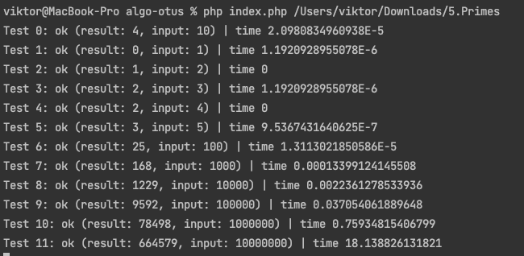
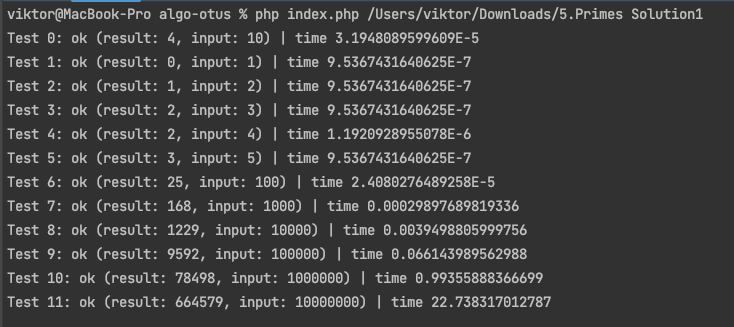
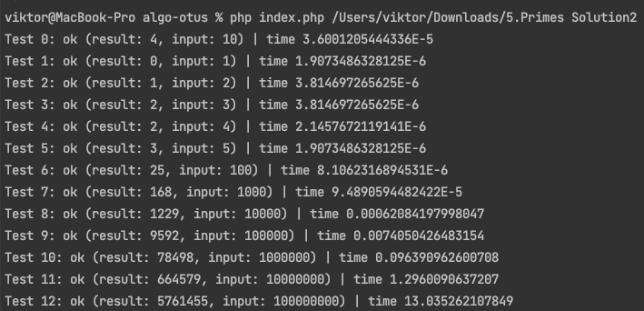

Алгоритм с поиском делителей ожидаемо самый долгий O(N^2)

Алгоритм поиск делителей среди простых чисел по ощущениям должен быть быстрее предыдущего, но по тестам оказался даже медленнее O(N^2) 

Самым быстрым является алгоритм решето Эрастофена, превосходит предыдущие по скорости примерно в ~10 раз O(N * log log N))

