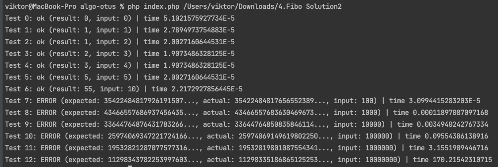

Php очень тяжело работать с большими числами, поэтому результаты алгоритмов не сильно валидны

Первый алгоритм - рекурсия, причем он немного оптимизирован и хранит в памяти старые вызовы рекурсий, чтобы не гонять по кругу одно и то же, в противном случае примерно на 6 тесте он встает

Итеративно сравнительно с рекурсией с оптимизацией, если же в рекурсии не сохранять предыдущие значения, то в разы быстрее

Через золотое сечение самый быстрый по скорости, но не очень надежный, на больших числах начинает мазать из-за количества знаков после запятой (видно, начиная с 7 теста)

Решение через матрицу с разложением степени на двоичное число работает медленнее золотого сечения, но зато получаются точные (правильные) числа

Работает быстрее, чем итеративно и рекурсией.

